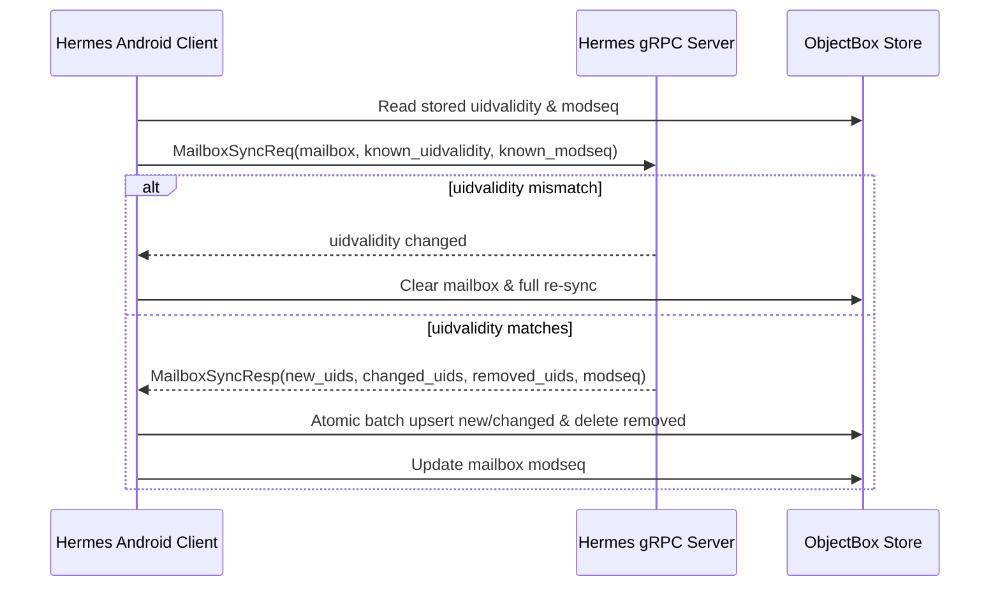

# State Management & Synchronization Specification

This document details the reactive state management architecture, offline-first persistent outbox engine, and CONDSTORE / MODSEQ incremental synchronization algorithms for the Hermes Android Kotlin SDK.

---

## 1. Unidirectional Data Flow (UDF) Architecture

The SDK enforces a strict Unidirectional Data Flow (UDF) pattern. The UI never mutates state directly. User interactions emit **Intents** which are committed atomically to the local ObjectBox database. ObjectBox native observers reactively push updated **State** to the UI via Kotlin `StateFlow`.

```text
┌─────────────────────────────────────────────────────────────┐
│                         Jetpack UI                          │
│     (Renders StateFlow; dispatches user actions/intents)    │
└──────────────┬──────────────────────────────▲───────────────┘
               │ User Action                  │ Reactive StateFlow
               ▼                              │
┌──────────────────────────────┐              │
│       Mutation Engine        │              │
│  (Marks dirty, inserts into  │              │
│   ObjectBox Outbox journal)  │              │
└──────────────┬───────────────┘              │
               │ ACID Transaction             │
               ▼                              │
┌─────────────────────────────────────────────┴───────────────┐
│                 ObjectBox Local Database                    │
│      (Single source of truth via memory-mapped FlatBuffers)  │
└──────────────┬──────────────────────────────▲───────────────┘
               │ Background Dispatch          │ Reconcile Sync
               ▼                              │
┌──────────────────────────────┐┌─────────────┴───────────────┐
│        Outbox Worker         ││      CONDSTORE/MODSEQ       │
│  (Dispatches queued network  ││         Sync Engine         │
│     mutations with jitter)   ││    (Pulls delta updates)    │
└──────────────────────────────┘└─────────────────────────────┘
```

---

## 2. Reactive UI Streams via StateFlow

All public repositories expose hot `StateFlow` instances. `StateFlow` retains the latest state, replays it immediately to new subscribers (conquering Android Activity/Fragment recreation), and conflates rapid updates.

### Implementation: Mailbox Flow

```kotlin
package pro.aduki.hermes.state.repository

import io.objectbox.Box
import io.objectbox.kotlin.flow
import kotlinx.coroutines.CoroutineScope
import kotlinx.coroutines.flow.SharingStarted
import kotlinx.coroutines.flow.StateFlow
import kotlinx.coroutines.flow.map
import kotlinx.coroutines.flow.stateIn
import pro.aduki.hermes.store.entities.Message
import pro.aduki.hermes.store.entities.Message_

class MailRepository(
    private val messageBox: Box<Message>,
    private val scope: CoroutineScope
) {

    fun observeMailbox(mailboxHex: String, pageSize: Long = 50): StateFlow<List<Message>> {
        return messageBox.query()
            .equal(Message_.mailbox, mailboxHex)
            .orderDesc(Message_.date)
            .build()
            .flow() // ObjectBox native C++ observer
            .stateIn(
                scope = scope,
                started = SharingStarted.WhileSubscribed(stopTimeoutMillis = 5000),
                initialValue = emptyList()
            )
    }
}
```

---

## 3. Persistent Transactional Outbox Engine

To achieve true offline resilience, any state-altering user action (sending email, marking read, archiving) is committed to an **Outbox** entity in the same atomic transaction that updates local UI state.

### 3.1. Optimistic Local Mutation

```kotlin
package pro.aduki.hermes.sync.outbox

import io.objectbox.BoxStore
import pro.aduki.hermes.store.entities.Message
import pro.aduki.hermes.store.entities.Message_
import pro.aduki.hermes.store.entities.Outbox

class OutboxManager(private val store: BoxStore) {

    fun toggleFlagOptimistic(messageHex: String, flagMask: Int) {
        store.runInTx {
            val msgBox = store.boxFor(Message::class.java)
            val outboxBox = store.boxFor(Outbox::class.java)

            val msg = msgBox.query().equal(Message_.hex, messageHex).build().findFirst() ?: return@runInTx

            // 1. Optimistically update local message state immediately
            msg.flags = msg.flags xor flagMask
            msg.dirty = true
            msgBox.put(msg)

            // 2. Commit mutation command into persistent Outbox
            val action = Outbox(
                action = "set_flags",
                payload = buildPayload(messageHex, flagMask),
                created = System.currentTimeMillis()
            )
            outboxBox.put(action)
        }
    }
}
```

### 3.2. Background Outbox Worker

The background worker executes sequentially, reading from the outbox and dispatching network requests using Decorrelated Jitter backoff. Upon successful transmission, the outbox record is removed.

---

## 4. CONDSTORE / MODSEQ Incremental Sync Algorithm

Hermes implements the RFC 7162 **CONDSTORE** and **MODSEQ** protocols. Instead of polling every email or scanning message lists, the client tracks two state variables per mailbox:

1. `uidvalidity`: Unique ID identifying the mailbox generation. If this changes, local cache must be invalidated.
2. `modseq`: Monotonically increasing 64-bit sequence number.

### 4.1. The Sync Flowchart



### 4.2. Implementation

```kotlin
package pro.aduki.hermes.sync.engine

import io.objectbox.BoxStore
import pro.aduki.hermes.proto.sync.MailboxSyncReq
import pro.aduki.hermes.proto.sync.SyncServiceGrpcKt
import pro.aduki.hermes.store.entities.Mailbox
import pro.aduki.hermes.store.entities.Mailbox_
import pro.aduki.hermes.store.entities.Message
import pro.aduki.hermes.store.entities.Message_

class MailboxSynchronizer(
    private val store: BoxStore,
    private val syncStub: SyncServiceGrpcKt.SyncServiceCoroutineStub
) {

    suspend fun sync(mailboxHex: String) {
        val mailboxBox = store.boxFor(Mailbox::class.java)
        val mailbox = mailboxBox.query().equal(Mailbox_.hex, mailboxHex).build().findFirst() ?: return

        val req = MailboxSyncReq.newBuilder()
            .setMailbox(mailboxHex)
            .setKnownUidvalidity(mailbox.uidvalidity.toInt())
            .setKnownModseq(mailbox.modseq)
            .build()

        val resp = syncStub.mailboxes(req)

        // Validate UIDVALIDITY
        if (resp.uidvalidity.toLong() != mailbox.uidvalidity) {
            handleUidValidityReset(mailboxHex, resp.uidvalidity.toLong())
            return
        }

        // Apply incremental delta in a single ACID transaction
        store.runInTx {
            val messageBox = store.boxFor(Message::class.java)

            // 1. Remove purged UIDs
            if (resp.removedUidsList.isNotEmpty()) {
                val toDelete = messageBox.query()
                    .equal(Message_.mailbox, mailboxHex)
                    .`in`(Message_.uid, resp.removedUidsList.map { it.toLong() }.toLongArray())
                    .build()
                    .find()
                messageBox.remove(toDelete)
            }

            // 2. Fetch and upsert changed/new UIDs
            // ...

            // 3. Update highest modseq
            mailbox.modseq = resp.modseq
            mailboxBox.put(mailbox)
        }
    }
}
```

---

## 5. Conflict Resolution Strategy

When offline actions conflict with server changes:

1. **Unread / Starred Flags**: Last-Write-Wins (LWW) per flag bit. If the client has a pending outbox entry (`dirty = true`), the local flag state is preserved until the outbox completes its push.
2. **Message Movement**: If a message was moved locally to "Trash" while the server marked it read, the local move action takes precedence.
3. **Deletions**: Server deletions supersede local metadata edits.
