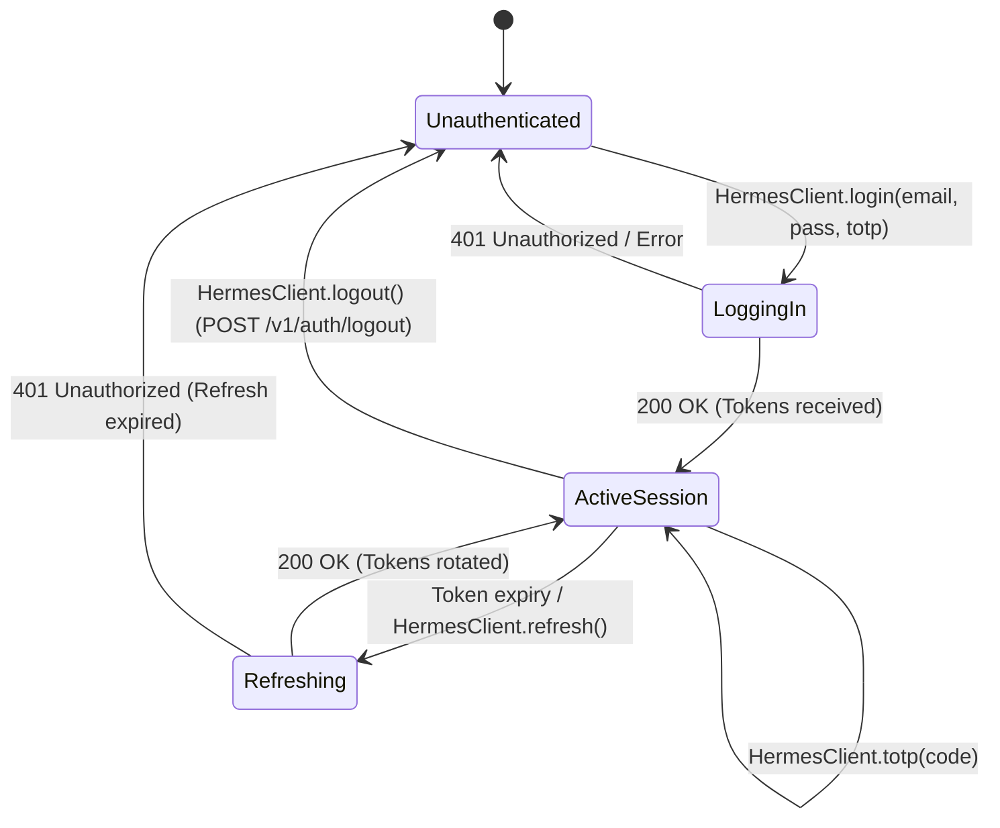

# Authentication & Session Architecture

The Hermes Android SDK provides a defense-in-depth authentication layer supporting interactive multi-factor sessions and headless machine API keys.

---

## 1. Authentication Schemes Matrix

The SDK strictly enforces separation between user identity sessions and service credentials:

| Property | Interactive User Session | Static Service API Key |
| :--- | :--- | :--- |
| **Primary Use Case** | Mobile Android applications with human users | Embedded kiosks, testing suites, CI automation |
| **Credentials** | Email + Password + optional 6-digit TOTP | Cryptographic API key (`hm_live_...` / `hm_test_...`) |
| **HTTP Authorization** | `Authorization: Bearer <jwt>` | `Authorization: Key <apiKey>` |
| **gRPC Metadata** | `authorization: Bearer <jwt>` | `authorization: Key <apiKey>` |
| **Token Lifetime** | 1 hour access token (JWT), 30-day refresh token | Indefinite until server revocation |
| **Rotation Strategy** | Silent background refresh via `POST /v1/auth/refresh` | Manual key replacement via client re-instantiation |
| **Local Persistence** | Android KeyStore envelope cipher (`AES-256-GCM`) | StrongBox / TEE sealed storage |
| **Revocation** | Remote server invalidation via `POST /v1/auth/logout` | Hermes Admin Console key deletion |

---

## 2. Session Lifecycle & State Machine



---

## 3. Core Data Types

### `Tokens`
Container for active access and refresh credentials returned from authentication endpoints:

```kotlin
package pro.aduki.hermes.net.http

data class Tokens(
    val token: String = "",
    val refresh: String = "",
    val expires: String = ""
)
```

- `token: String`: Short-lived JSON Web Token (JWT) passed in `Authorization: Bearer <jwt>`.
- `refresh: String`: Cryptographically random refresh token passed to `POST /v1/auth/refresh`.
- `expires: String`: ISO-8601 UTC timestamp indicating when `token` becomes invalid.

### `Identity`
Resolved tenant and user profile retrieved via `GET /v1/auth/whoami`:

```kotlin
package pro.aduki.hermes.state.repository

data class Identity(
    val user: String = "",
    val tenant: String = "",
    val owner: Boolean = false,
    val scopes: List<String> = emptyList(),
    val tier: String = ""
)
```

- `user: String`: Unique user identifier hex string.
- `tenant: String`: Organization / tenant isolation hex string.
- `owner: Boolean`: True if the user possesses administrative privileges within the tenant.
- `scopes: List<String>`: List of authorized capability strings (e.g., `mail:read`, `mail:write`, `contacts:sync`).
- `tier: String`: Account service tier (`free`, `pro`, `enterprise`).

---

## 4. Hardware Security Guarantees

All authentication tokens and credentials adhere to the following zero-exposure runtime rules:

1. **Envelope Encryption**: Tokens stored locally are encrypted with an AES-256-GCM data encryption key sealed by the Android KeyStore hardware root of trust (StrongBox or TEE).
2. **In-Memory Zeroization**: Plaintext passwords, TOTP codes, and sensitive buffers are allocated in guarded memory segments and wiped immediately after transmission (`wipe(ByteArray)`).
3. **Automatic Cache Clear**: Invoking `logout()` terminates the remote session on Hermes REST, wipes local KeyStore entries, and transitions reactive `Session` state flows to `null`.

