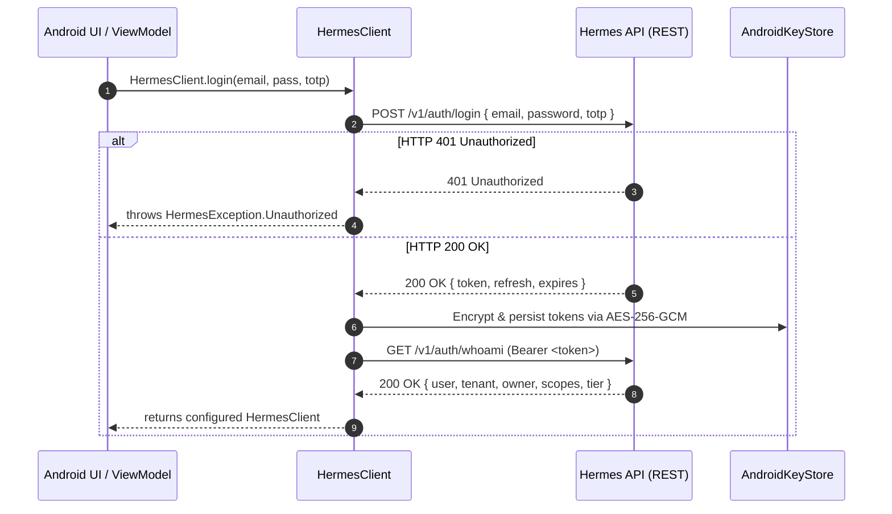

# Interactive Login Reference

Interactive login enables human users to authenticate against Hermes using their email credentials and an optional 6-digit Time-based One-Time Password (TOTP).

---

## 1. Method Specification

```kotlin
package pro.aduki.hermes.sdk

suspend fun HermesClient.Companion.login(
    email: String,
    password: String,
    totp: String? = null,
    endpoint: String = Endpoints.REST
): HermesClient
```

### Parameters

| Parameter | Type | Required | Default | Description |
| :--- | :--- | :--- | :--- | :--- |
| `email` | `String` | Yes | — | User's primary email address (e.g., `user@aduki.pro`). |
| `password` | `String` | Yes | — | User account password in cleartext (zeroized from memory immediately after network dispatch). |
| `totp` | `String?` | No | `null` | Optional 6-digit numeric TOTP confirmation code if 2FA is active on the account. |
| `endpoint` | `String` | No | `Endpoints.REST` | Base URL of the Hermes REST API (e.g., `https://hermers.aduki.pro/v1`). |

### Return Value

- **Type**: `HermesClient`
- **Description**: Fully initialized and configured client instance holding the active JWT access token, refresh token, and pre-cached `Identity`.

### Throws

| Exception | Cause / Condition |
| :--- | :--- |
| `HermesException.Unauthorized` | HTTP `401 Unauthorized` — Invalid password, non-existent email, or incorrect/missing TOTP code. |
| `HermesException.Network` | Non-200 HTTP status (e.g., 500, 502, 503) or underlying TCP/TLS transport failures. |

---

## 2. Network Protocol Specification

### HTTP Request

```http
POST /v1/auth/login HTTP/1.1
Host: hermers.aduki.pro
Content-Type: application/json; charset=utf-8
Accept: application/json
User-Agent: Hermes-Android-SDK/1.0.0

{
  "email": "user@aduki.pro",
  "password": "CorrectHorseBatteryStaple123!",
  "totp": "123456"
}
```

- **JSON Payload Fields**:
  - `email` (`String`, required): RFC 5322 compliant address.
  - `password` (`String`, required): User secret.
  - `totp` (`String`, optional): Exactly 6 numeric digits (`^[0-9]{6}$`). Omitted from JSON when `null`.

### HTTP Response (200 OK)

```http
HTTP/1.1 200 OK
Content-Type: application/json; charset=utf-8

{
  "token": "eyJhbGciOiJFUzI1NiIsInR5cCI6IkpXVCJ9...",
  "refresh": "rt_8f3a02c91b4e5d6f7a8b9c0d1e2f3a4b",
  "expires": "2026-09-08T23:15:00Z"
}
```

- **JSON Response Fields**:
  - `token` (`String`): Active Ed25519-signed or ES256-signed JWT access token.
  - `refresh` (`String`): Opaque 32-byte hexadecimal refresh token.
  - `expires` (`String`): ISO-8601 UTC timestamp of token expiry.

---

## 3. Execution Sequence



---

## 4. Production ViewModel Integration

```kotlin
class LoginViewModel : ViewModel() {

    private val _state = MutableStateFlow<LoginState>(LoginState.Idle)
    val state: StateFlow<LoginState> = _state.asStateFlow()

    fun login(email: String, pass: String, totp: String? = null) {
        viewModelScope.launch(Dispatchers.IO) {
            _state.value = LoginState.Loading
            try {
                val client = HermesClient.login(
                    email = email.trim(),
                    password = pass,
                    totp = totp?.trim()?.ifBlank { null }
                )
                
                // Identity is eagerly cached
                val identity = client.me()
                _state.value = LoginState.Success(client, identity)
            } catch (e: HermesException.Unauthorized) {
                _state.value = LoginState.Error("Invalid credentials or 2FA code")
            } catch (e: HermesException.Network) {
                _state.value = LoginState.Error("Network error: ${e.message}")
            }
        }
    }
}

sealed interface LoginState {
    data object Idle : LoginState
    data object Loading : LoginState
    data class Success(val client: HermesClient, val identity: Identity?) : LoginState
    data class Error(val message: String) : LoginState
}
```

