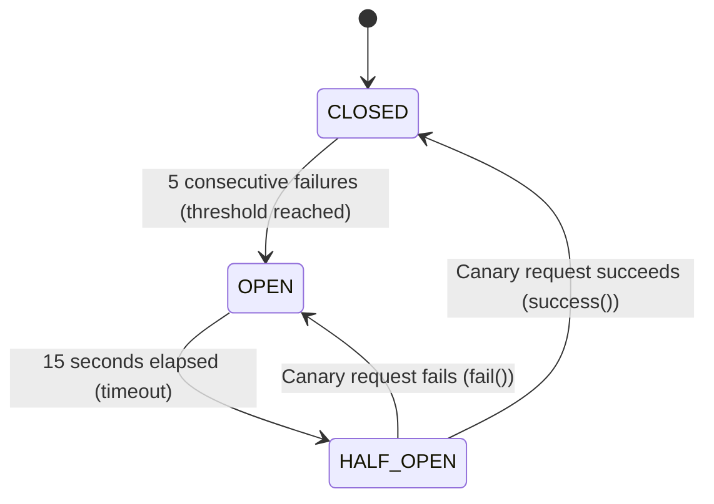

# Circuit Breaker & Fault Tolerance Reference

To conserve device battery and eliminate unnecessary radio wakeups during network outages, the Hermes Android SDK wraps network operations in a non-blocking 3-state `Circuit` breaker.

---

## 1. Class & Method Signatures

```kotlin
package pro.aduki.hermes.core.retry

import pro.aduki.hermes.core.errors.HermesException

class Circuit(
    private val threshold: Int = 5,
    private val timeout: Long = 15_000
) {
    enum class State {
        CLOSED,
        OPEN,
        HALF_OPEN
    }

    fun state(): State
    fun success()
    fun fail()
    inline fun <T> execute(block: () -> T): T
}
```

### Parameters

| Parameter | Type | Default | Description |
| :--- | :--- | :--- | :--- |
| `threshold` | `Int` | `5` | Number of consecutive exceptions before the circuit trips from `CLOSED` to `OPEN`. |
| `timeout` | `Long` | `15_000` | Cooldown duration in milliseconds before an `OPEN` circuit transitions to `HALF_OPEN` for a canary probe. |

---

## 2. State Machine Specification



### State Behaviors

| State | Request Execution Behavior |
| :--- | :--- |
| **`CLOSED`** | Normal execution. All requests execute directly. Failures increment an atomic counter; any success resets the failure count to 0. |
| **`OPEN`** | Fail-fast mode. Calls to `execute { ... }` immediately throw `HermesException.CircuitOpen` without executing the block or waking the radio modem. |
| **`HALF_OPEN`** | Canary probing mode. Allows a single execution. If it succeeds, circuit resets to `CLOSED`. If it fails, circuit immediately returns to `OPEN`. |

---

## 3. Usage & Exception Handling Example

```kotlin
val circuit = Circuit(threshold = 5, timeout = 15_000L)

try {
    val response = circuit.execute {
        transport.dispatch(payload)
    }
} catch (e: HermesException.CircuitOpen) {
    // Immediate fail-fast: device is offline or remote service is unresponsive
    // Outbox actions remain safely stored in local ObjectBox database
    showOfflineStatusBanner()
} catch (e: Exception) {
    // Network or transport error — circuit counted this as a failure
    Log.w("Hermes", "Call failed: ${e.message}")
}
```

